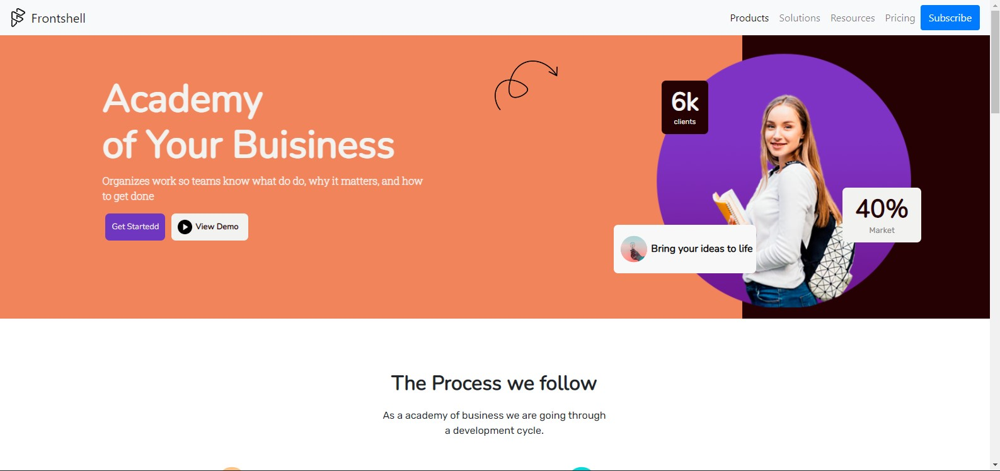

# Mod-15

<!---Esses são exemplos. Veja https://shields.io para outras pessoas ou para personalizar este conjunto de escudos. Você pode querer incluir dependências, status do projeto e informações de licença aqui--->

> Projeto para o Modulo 15 do curso Engenheiro Front-End da EBAC.
### Ajustes e melhorias

O projeto ainda está em desenvolvimento e as próximas atualizações serão voltadas nas seguintes tarefas:

- [x] Definir o Layout do Site
- [x] Definição de Cores e Fontes
- [x] Desenvolvimento do Site
- [x] Aperfeiçoamento do site
- [x] Debug and Run 

## 💻 Pré-requisitos

Antes de começar, verifique se você atendeu aos seguintes requisitos:
<!---Estes são apenas requisitos de exemplo. Adicionar, duplicar ou remover conforme necessário--->
* Você instalou a versão mais recente de `<linguagem / dependência / requeridos>`
* Você tem uma máquina `<Windows / Linux / Mac>`..
* Você leu `<guia / link / documentação_relacionada_ao_projeto>`.

## 🚀 Instalando MOD-15

Para instalar o MOD-15, siga estas etapas:

Faça o Download dos arquivos e os abra, ou clone o projeto pelo github e o abra no seu editor de código.

## ☕ Usando MOD-15

Para usar MOD-15, siga estas etapas:

- Abra e execute o arquivo index dentro da pasta Mod-15.

Adicione comandos de execução e exemplos que você acha que os usuários acharão úteis. Fornece uma referência de opções para pontos de bônus!

## 📫 Contribuindo para MOD-15
<!---Se o seu README for longo ou se você tiver algum processo ou etapas específicas que deseja que os contribuidores sigam, considere a criação de um arquivo CONTRIBUTING.md separado--->
Para contribuir com MOD-15, siga estas etapas:

1. Bifurque este repositório.
2. Crie um branch: `git checkout -b <nome_branch>`.
3. Faça suas alterações e confirme-as: `git commit -m '<mensagem_commit>'`
4. Envie para o branch original: `git push origin <nome_do_projeto> / <local>`
5. Crie a solicitação de pull.

Como alternativa, consulte a documentação do GitHub em [como criar uma solicitação pull](https://help.github.com/en/github/collaborating-with-issues-and-pull-requests/creating-a-pull-request).

## 😄 Seja um dos contribuidores 

Quer fazer parte desse projeto? Clique [AQUI](CONTRIBUTING.md) e leia como contribuir.

[⬆ Voltar ao topo](MOD-15) 